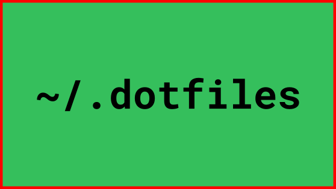

# [Boseji's](https://github.com/boseji) dotfiles - Linux configuration files



This repository contains various scripts and configuration files -
for the Linux distribution used by [@boseji](https://github.com/boseji) .

Note: The artifact are highly opinionated and specific to 
[@boseji's](https://boseji.com) liking.

In short this is more inclined towards [**Manjaro Linux** (Arch Linux)](https://manjaro.org/).

## Installation

> **Warning:** If you are not sure about what these files
> might do to your system - DO NOT Proceed !
>
> **Use them at your own risk !**

```shell
# Clone and Initialize
cd 
git clone https://github.com/boseji/dotfiles.git
cd dotfiles
# Install required Packages
./install-packages
# Initialize the Local scripts
./install-bin 
# Initialize the local Profile
./install-profile
...
# Optionally run other install scripts
...

# Install other packages
./install-hugo

```

### Force Initialization for Profile

In case if you have messed up something with `.bashrc` or profile options in general
then use the `-f` in the `install-profile` script.

```shell
# Initialize the local Profile with Force restore
./install-profile -f
```

This would restore the original files first.
Then it would apply the profile changes.

## Try Out

If you wish to try out the shortcuts before installing - Try this:

```shell
# cd to the location containing the 'dotfiles' repository
source ./bash.aliases.sh
source ./bash.exports.sh
```

All the `install-*` scripts are self contained.
They too can be run independently.

## License

All the files in this repository conform to 
[**GNU General Public License v2.0**](LICENSE)
unless otherwise specified.

SPDX-License-Identifier: GPL-2.0-only
